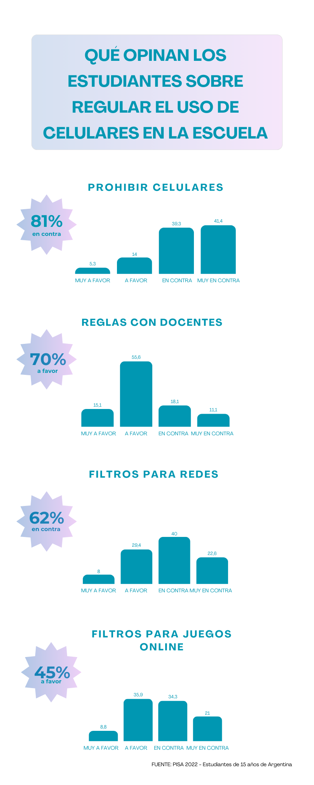

TÍTULO
# pisa-student-attitudes-mobile-phones
Analysis of student attitudes toward mobile phone regulation in schools using PISA 2022 data (Argentina).

DESCRIPTION
This project explores how students perceive different forms of digital device regulation in schools.
Using data from the PISA 2022 student questionnaire, the analysis focuses on responses from students in Argentina regarding:
- banning mobile phones
- rule-making with teachers
- filtering social media
- blocking online games
- teacher monitoring of device use

RESEARCH QUESTION
Do students support banning mobile phones in school, or do they prefer other forms of regulation?

KEY FINDINGS
81% of students oppose banning mobile phones in class.
However:
- 71% support creating rules together with teachers
- 55% accept teacher monitoring of device use
- opinions are divided about banning online games

DATA SOURCE
OECD PISA 2022 Student Questionnaire

TOOL USED
Python
Pandas
Google Colab
